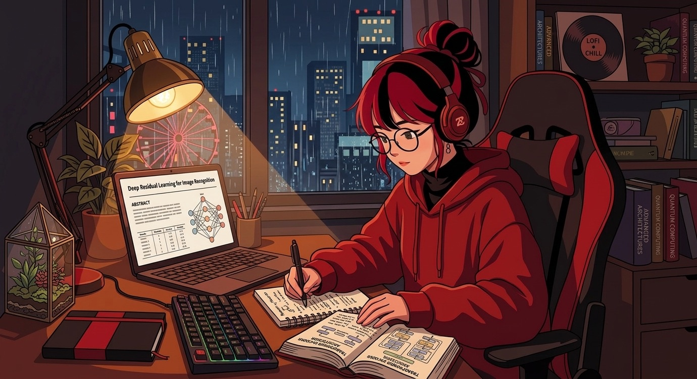
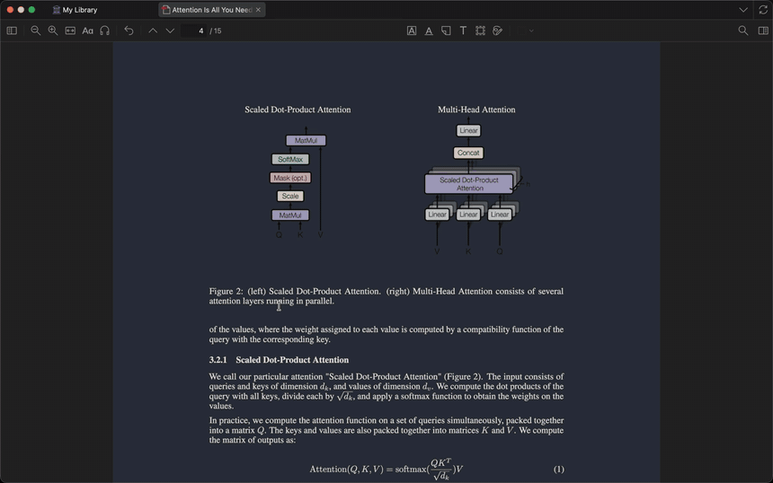
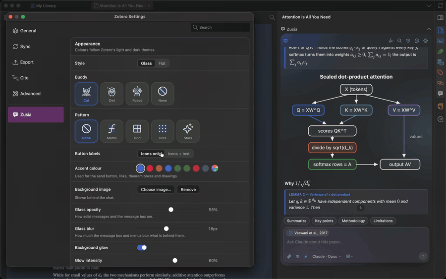
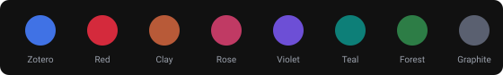
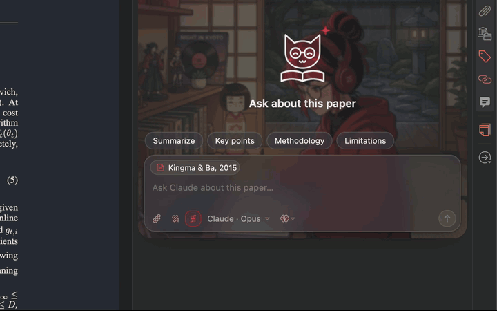
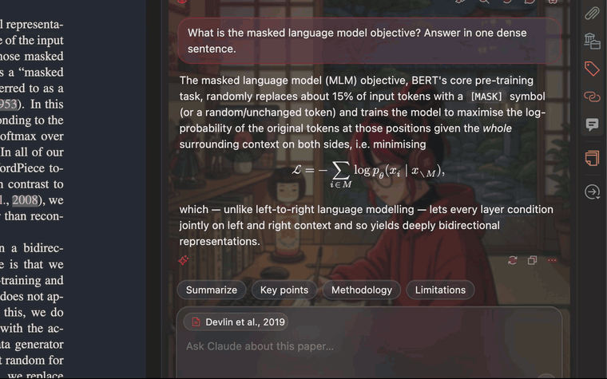
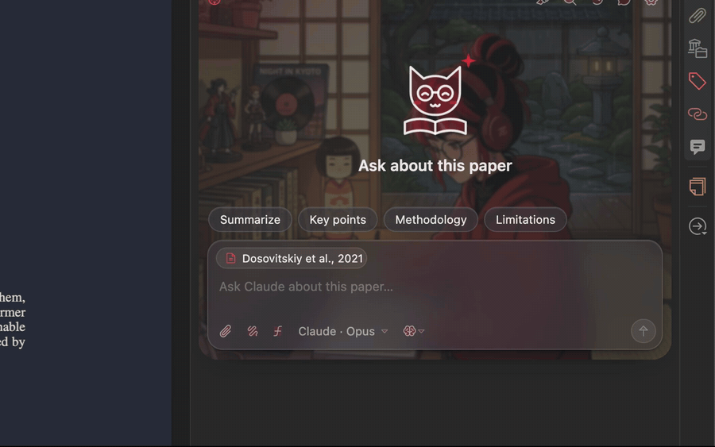

<p align="center"></p>

<h1 align="center">Zusia</h1>

<p align="center"><b>Your study buddy inside Zotero.</b><br>Ask about the paper you're reading. Get maths, drawings and proofs back.</p>

<p align="center">
  <a href="https://github.com/firekern/zusia/actions/workflows/ci.yml"></a>
  <a href="https://github.com/firekern/zusia/releases/latest"></a>
  
  
  
  <a href="LICENSE"></a>
</p>

<p align="center"></p>

**TL;DR**

- 💬 A chat **next to the PDF**, in Zotero's side pane.
- ✏️ Answers with **LaTeX**, **drawings** and numbered **theorem boxes**.
- 🔑 Uses **Claude Code, Codex or Antigravity** with your own login. No API keys.
- ⏱️ Install in 2 minutes: [jump to Install](#install).

<p align="center"></p>

## 1. Ask about the paper

> **Open the side pane → Zusia → ask.** Turn on *Drawing* and *LaTeX* for a diagram and real maths.
>
> Real recording: Zotero on a Mac, *Attention Is All You Need*, a live answer from Claude. 27 seconds, with the wait sped up.

<p align="center"></p>

<p align="center"><a href="docs/videos/zusia-chat.mp4">▶ Watch in full quality (MP4)</a></p>

## 2. Make it yours

> **Settings → Zusia.** Style, buddy, pattern, accent colour, background image and button labels, all updating live in the sidebar. Glass, corners, font, answer length, level and tone are there too.

<p align="center"></p>

<p align="center"><a href="docs/videos/zusia-style.mp4">▶ Watch in full quality (MP4)</a></p>

<p align="center"></p>

<p align="center"><sub>Eight accents. Red on black is the one in every video here.</sub></p>

## 3. Follow a proof

> **Turn on *LaTeX*.** Definitions, lemmas and theorems come back as numbered boxes, and every `\ref` is a link: click to jump, **Back** (⌥←) to return.

<p align="center"></p>

<p align="center"><a href="docs/videos/zusia-proof.mp4">▶ Watch in full quality (MP4)</a></p>

## 4. Didn't click? Ask again, better

> **One button under every answer.** It comes back with the intuition first, then the steps, an example and the usual trap.

<p align="center"></p>

<p align="center"><a href="docs/videos/zusia-explain-better.mp4">▶ Watch in full quality (MP4)</a></p>

## 5. Ask about a figure

> **📎 → *Current PDF page*.** The page you are looking at goes with the question, so figures and tables can be asked about. Upload, paste, drop or screenshot work too.

<p align="center"></p>

<p align="center"><a href="docs/videos/zusia-figure.mp4">▶ Watch in full quality (MP4)</a></p>

<p align="center"></p>

## Everything else, in one line each

| | Feature | How |
|:--:|---|---|
| 🔴 | **Explain a passage** | Select text in the PDF → *Explain this* |
| 🟠 | **Ask about a passage** | Select text → *Ask your assistant about this*, then add your question |
| 🩷 | **Clarifications** | Every Ask and Explain is saved: highlighter icon → passage, prompt, answer |
| 🟣 | **Notes** | Save any answer or drawing as a Zotero note under the paper |
| 🔵 | **Search** | 🔍 searches the chats of every paper |
| 🟢 | **Models** | Pick assistant, model and reasoning effort from the message box |
| ⚫ | **Setup** | A visual wizard on first run |

## Install

1. **Install one assistant CLI** and sign in: [Claude Code](https://docs.anthropic.com/en/docs/claude-code), [Codex](https://github.com/openai/codex) or Antigravity (`agy`).
2. **Download `zusia.xpi`** from the [latest release](https://github.com/firekern/zusia/releases/latest).
3. **In Zotero:** Tools → Plugins → ⚙ → *Install Plugin From File…* → pick the `.xpi`. Restart if asked.
4. **Open a paper.** Zusia appears in the side pane and starts the setup wizard.

Updates arrive on their own after that: Zotero checks the release feed.

## Privacy

- 🖥️ The assistants run **on your computer** with your own login. No server, no API keys.
- 📄 They get the paper's **metadata and your annotations**, never the PDF's full text. Plus any image you attach.
- 📁 Chats, clarifications and images stay in `zusia/` inside Zotero's data folder.

<p align="center"></p>

<details>
<summary><b>For developers: build, test, release, record the videos</b></summary>

## Build

```sh
npm ci
npm run build        # writes zusia.xpi
```

## Test

```sh
npm test             # unit tests (jsdom): rendering, settings, wizard, backends, repo checks
npm run shots        # screenshots of the UI in headless Firefox (optional)
npm run test:zotero  # headless Zotero integration run (Linux, Flatpak)
ZUSIA_BACKGROUND=path/to/illustration.jpg npm run videos   # re-records the README videos (macOS)
```

The videos are recorded in a real Zotero with its own demo profile and library, so your library is never used. The scenes move the real pointer: don't touch the Mac while they run. Needs `ffmpeg`, `cliclick`, the `claude` CLI, and Screen Recording and Accessibility permission for the terminal.

## Release

Bump `version` in `package.json` and `src/manifest.json`, then tag it:

```sh
git tag v1.1.0 && git push origin v1.1.0
```

The tag is what releases. `.github/workflows/release.yml` refuses to run if the tag and the two versions disagree, then runs the tests, builds the `.xpi`, writes `updates.json` and attaches both to a GitHub release. Pushing to `main` never publishes anything.

New behaviour starts with a failing test; see [CONTRIBUTING.md](CONTRIBUTING.md).

</details>

## Credits

Icons: [Phosphor Icons](https://phosphoricons.com) (MIT). Maths: [KaTeX](https://katex.org) (MIT) and Latin Modern Math (GUST Font License). The study buddies are original to this project; the illustrations were made for Zusia with Google Gemini. Papers in the videos: arXiv 1706.03762, 1512.03385, 1810.04805, 2010.11929, 2005.14165, 1412.6980. Details in [THIRD_PARTY_NOTICES.md](THIRD_PARTY_NOTICES.md).

Zusia is MIT licensed. See [LICENSE](LICENSE).
